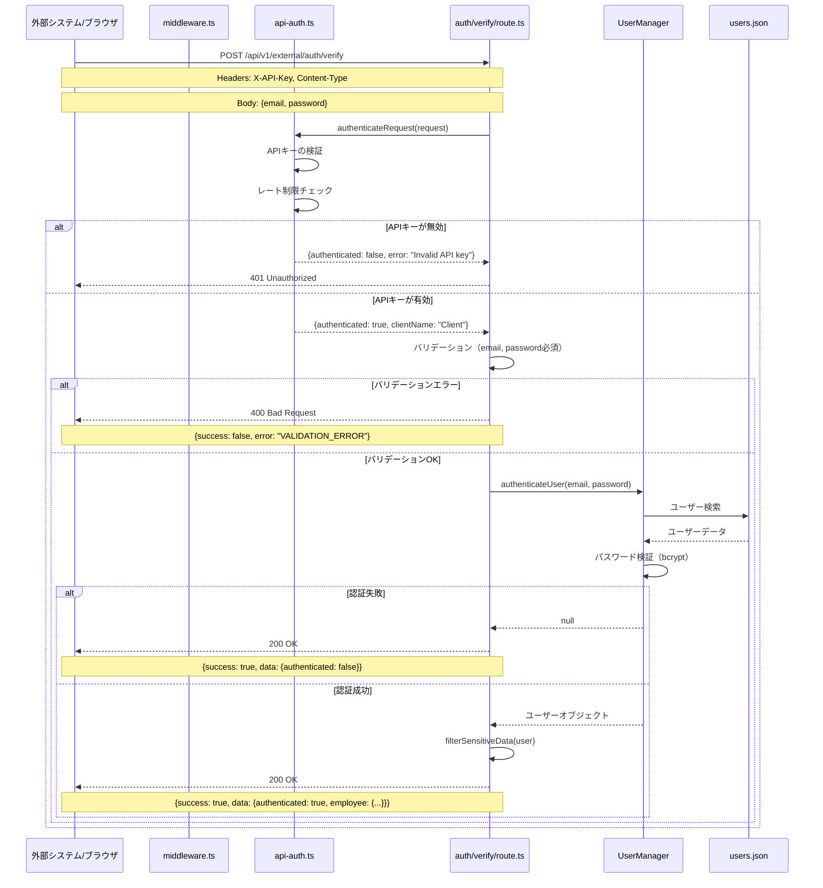
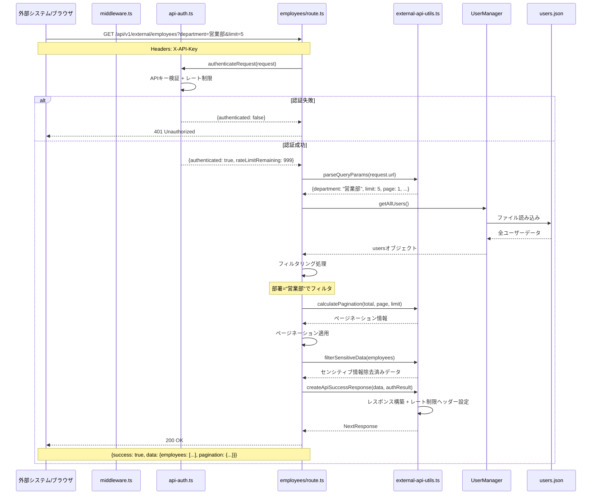
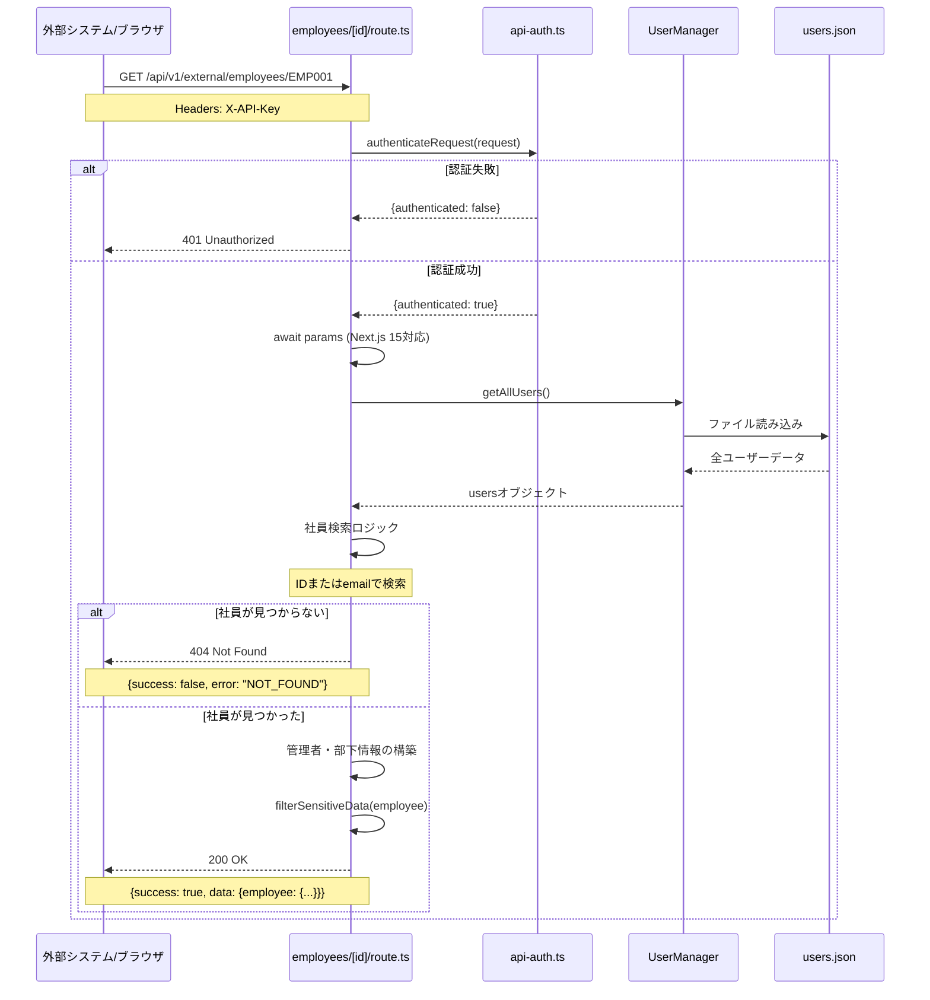
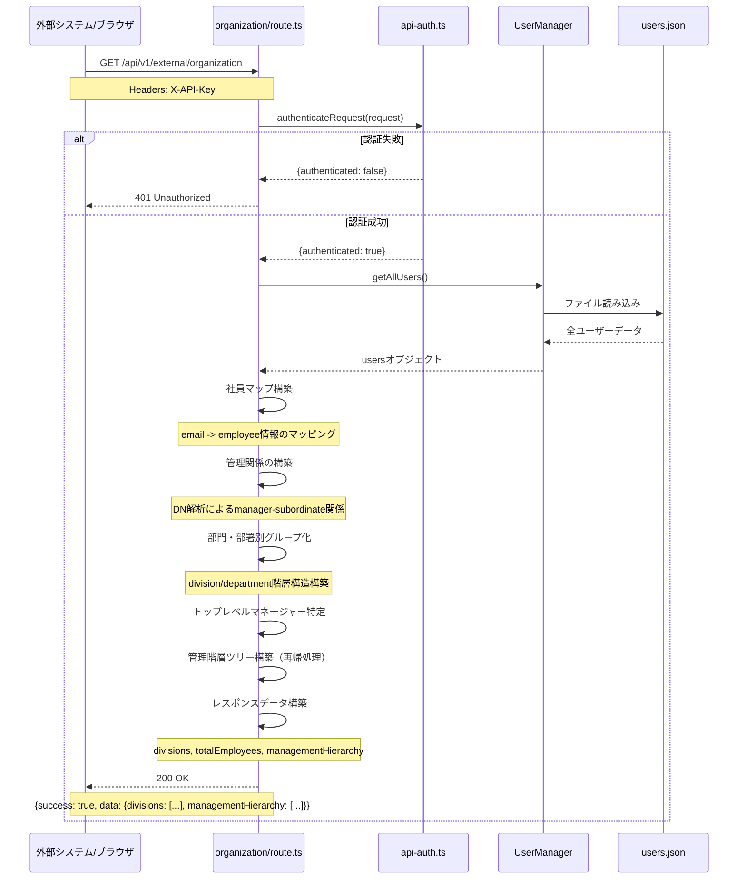
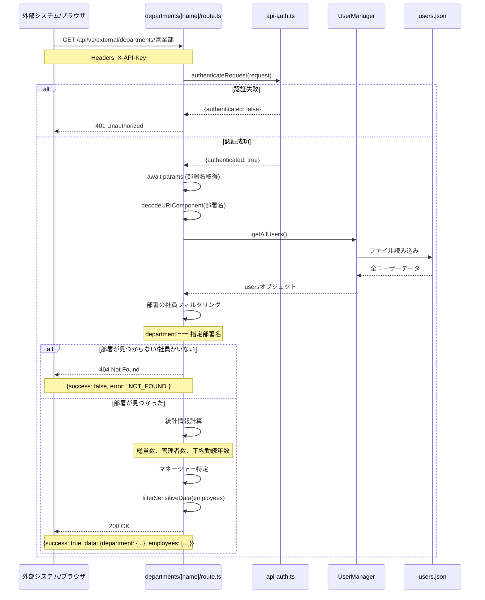
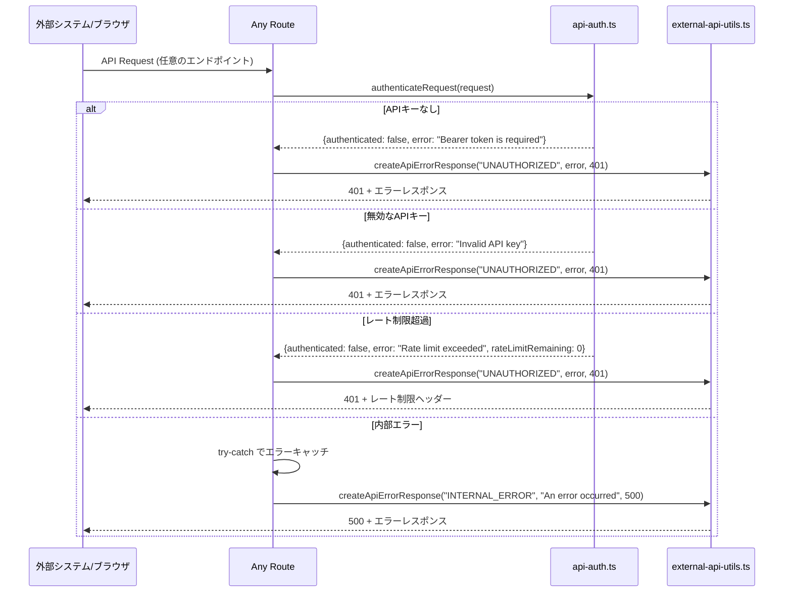
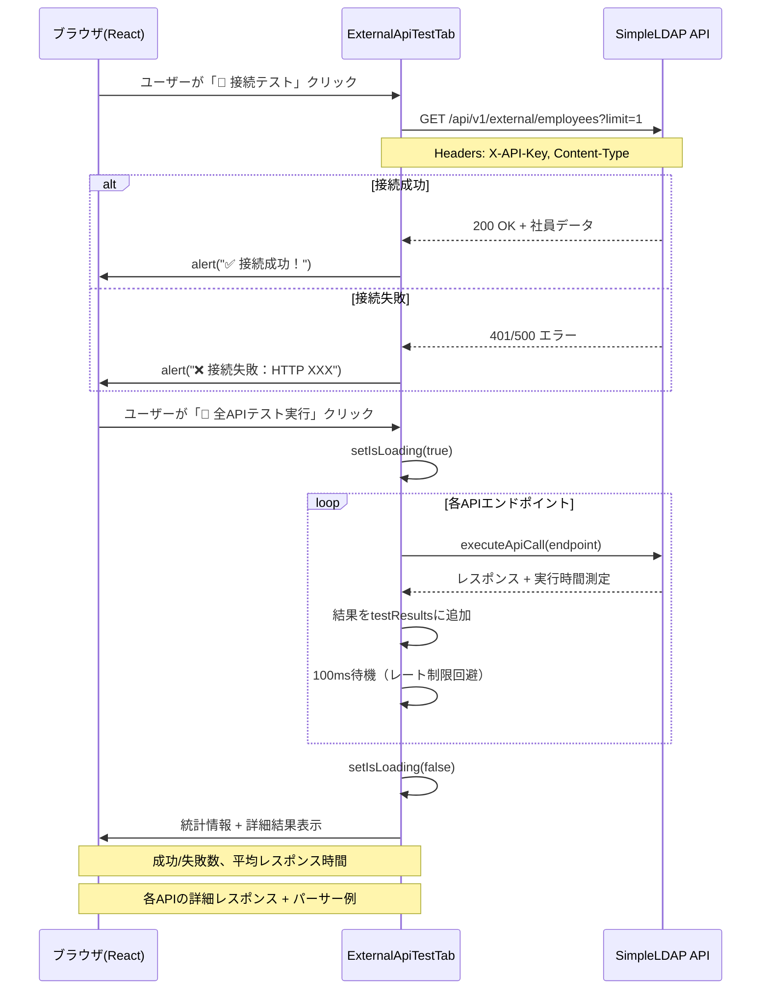
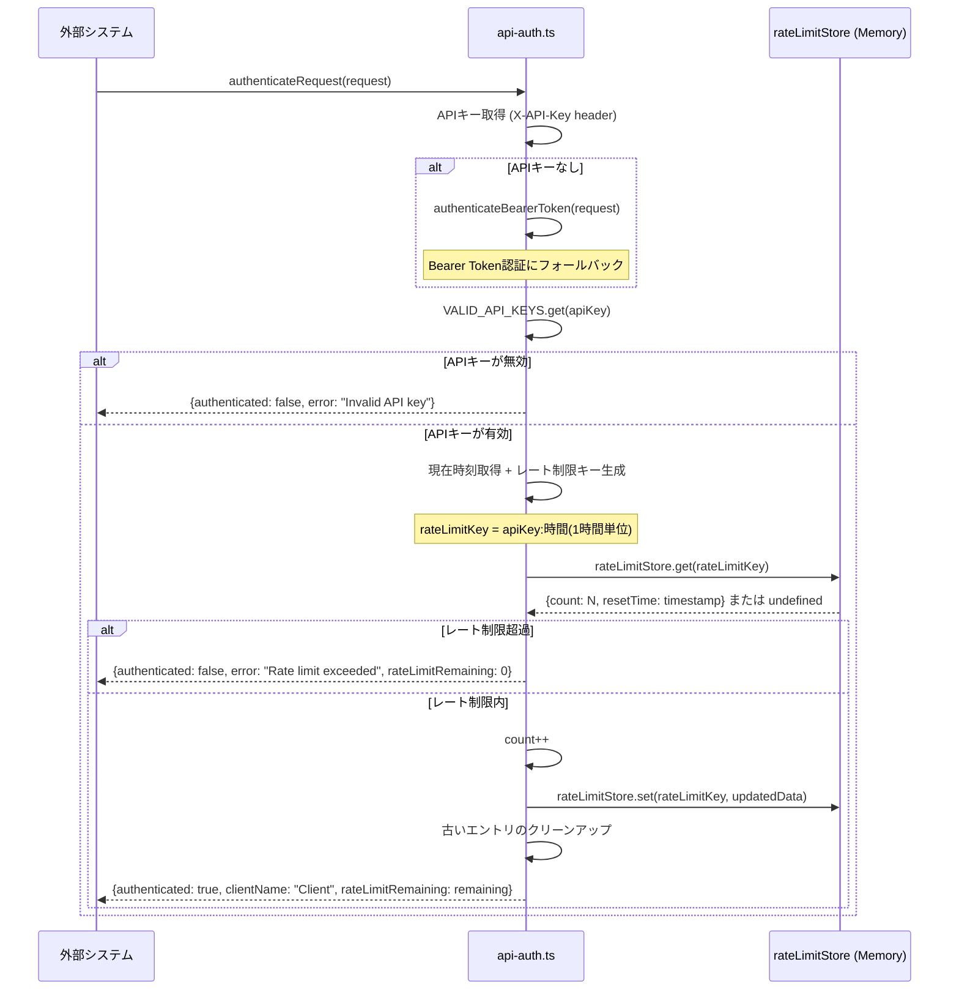

# SimpleLDAP 外部API シーケンス図

## 概要
SimpleLDAPの外部APIシステムにおける各種やりとりをシーケンス図で表現します。

---

## 1. 認証API（POST）のシーケンス

---

## 2. 社員一覧API（GET）のシーケンス

---

## 3. 社員詳細API（GET）のシーケンス

---

## 4. 組織構造API（GET）のシーケンス

---

## 5. 部署詳細API（GET）のシーケンス

---

## 6. エラーハンドリングのシーケンス

---

## 7. 外部APIテストタブからのシーケンス

---

## 8. 認証・レート制限の詳細フロー

---

## 主な特徴

### 🔐 セキュリティレイヤー
- **APIキー認証**: 全エンドポイントで必須
- **レート制限**: 時間あたりのリクエスト数制御
- **データフィルタリング**: センシティブ情報の自動除去

### 📊 データ処理
- **統一レスポンス**: 全APIで共通のレスポンス形式
- **エラーハンドリング**: 詳細なエラー情報とHTTPステータス
- **パフォーマンス**: ページネーション、フィールド選択

### 🚀 拡張性
- **認証プロバイダー**: Bearer Token認証のサポート
- **メタデータ**: タイムスタンプ、バージョン情報
- **CORS対応**: ブラウザからの直接アクセス可能

このシーケンス図により、SimpleLDAP外部APIの全体的な動作フローとコンポーネント間の相互作用を理解できます。